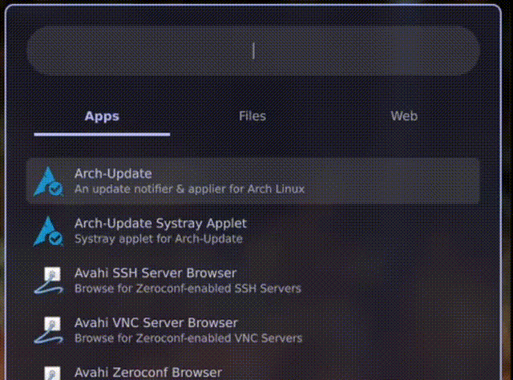
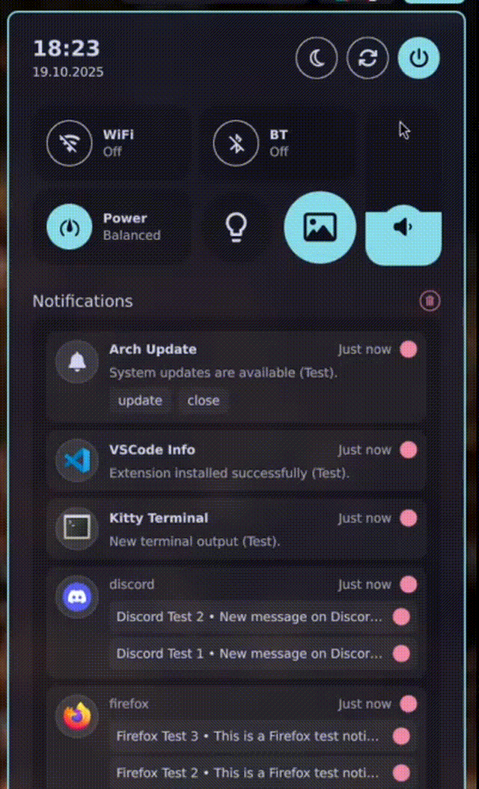

# blurshell

[](https://www.gnu.org/licenses/gpl-3.0)
[](https://github.com/Hashtaxx/blurshell)
[](https://quickshell.outfoxxed.me)
[](https://hyprland.org)


https://github.com/user-attachments/assets/77173184-023a-4a05-9790-f767839d06a9


**Version:** 0.1.2

> **Note:** This shell was designed and tested primarily on a triple 2K monitor setup (three 2560x1440 displays). It should still function correctly on smaller or single-monitor setups, but some configuration on spacings may be needed.

## 📸 Screenshots

### Top Bar


The top bar displays the workspace manager with multiple sections. Each section represents one monitor - in this example, there are three sections for the triple monitor setup. Each section shows the workspaces assigned to that specific monitor, allowing you to quickly switch between workspaces on individual displays.

### Launcher


### Control Center



## ✨ Features

- **Multi-Monitor Support**: Master-screen configuration with spanning wallpapers
- **Top Bar**: Workspace switcher for multiple monitors with system tray integration
- **Launcher**: Search for applications, files, and web search engines
- **Control Center**: Audio mixer, Bluetooth, network, Hyprsunset, power modes, and wallpaper switcher
- **Clipboard History**: Full-featured clipboard manager powered by ClipHist
- **Lock Screen**: Secure lock screen with PAM authentication
- **Settings Window**: GUI configuration interface
- **Theme System**: Multiple Catppuccin themes with beautiful color schemes
- **Smart Notifications**: Advanced notification daemon with popup management

## 🏗️ Architecture

Built on top of these core technologies:

- **Widget System**: [`QuickShell`](https://quickshell.outfoxxed.me) - Declarative QML-based shell toolkit
- **Window Manager**: [`Hyprland`](https://hyprland.org) - Dynamic tiling Wayland compositor

## 📦 Installation

### Quick Start

Simply clone this repository into your `.config/quickshell/` directory:

```sh
git clone https://github.com/Hashtaxx/blurshell.git ~/.config/quickshell
```

Then install the dependencies and start QuickShell.


### Dependencies

#### Required

I'm not sure if you really need all of those packages, but I do have these:

- [`quickshell`](https://quickshell.outfoxxed.me) - Widget system
- [`hyprland`](https://hyprland.org) - Wayland compositor
- [`cliphist`](https://github.com/sentriz/cliphist) - Clipboard manager
- [`hyprsunset`](https://github.com/hyprwm/hyprsunset) - Blue light filter for Hyprland
- `qt6-declarative` - Qt6 QML support
- `qt6-5compat` - Qt5 compatibility module
- `qt6-wayland` - Qt6 Wayland support
- `qt5-wayland` - Qt5 Wayland support
- `qt5-graphicaleffects` - Qt5 graphical effects
- `qt5ct` - Qt5 configuration tool
- `qt6ct` - Qt6 configuration tool
- `ttf-nerd-fonts-symbols` - Nerd Fonts icon symbols
- `xdg-desktop-portal-gtk` - GTK file picker portal
- `xdg-desktop-portal-hyprland` - Hyprland-specific portal implementation
- `wireplumber` - PipeWire session manager (audio)
- `pipewire` - Audio
- `bluez` - Bluetooth protocol stack
- `networkmanager` - Network management (WiFi, Ethernet)

#### Recommended

- [`wtype`](https://github.com/atx/wtype) - Wayland typing tool to directly paste clipboard entries
- [`hyprshot`](https://github.com/Gustash/hyprshot) - Screenshot utility

### Arch Linux

1. **Install dependencies**:

```sh
sudo pacman -S quickshell-git hyprland cliphist hyprsunset wtype hyprshot \
    qt6-declarative qt6-5compat qt6-wayland qt5-wayland \
    qt5-graphicaleffects qt5ct qt6ct ttf-nerd-fonts-symbols \
    xdg-desktop-portal-gtk xdg-desktop-portal-hyprland \
    wireplumber pipewire bluez networkmanager
```

2. **Clone the repository**:

```sh
git clone https://github.com/Hashtaxx/blurshell.git ~/.config/quickshell
```

3. **Adjust your hyprland.conf**:

Add these recommended adjustments to your `hyprland.conf` for the best QuickShell experience:

```conf
# --- QuickShell recommended settings ---

# Fix wallpaper stretching on vertical monitors
render {
    expand_undersized_textures = false
}

# Prevent duplicated splash effects
misc {
    force_default_wallpaper = -1
    disable_hyprland_logo = true
    disable_splash_rendering = true
}

# Enable blur effect for QuickShell
decoration {
    active_opacity = 1
    inactive_opacity = 1

    blur {
        enabled = true
        size = 8
        passes = 2
        vibrancy = 0.1696
    }

    layerrule = blur, quickshell
    layerrule = ignorealpha 0.1, quickshell
}

# Prevent mouse cursor from jumping between monitors on workspace switch
cursor:no_warps 1
```

**Note:** Add a Workspace config if needed for your setup.

4. **Start QuickShell**:

```sh
quickshell
```

### NixOS
*NixOS support is not yet available, but I'd love to explore it if there's enough community interest!*

## 🚀 Usage

### Starting the Shell

QuickShell can be started manually:

```sh
quickshell
```

Or add it to your Hyprland config for autostart:

```conf
exec-once = quickshell
```

### Configuration

The default configuration uses my personal settings. You can adjust options either by editing the `config.json` file directly or using the graphical interface. To open the settings panel, click the Control Center in the top right, then select Settings in the bottom right corner.

### Available keybinds

These are the keybinds Quickshell listens for. You can map them in your `hyprland.conf`. Below is a suggested snippet using Hyprland's bindr/bind syntax and the `qs ipc` interface.

```conf
# Suggested hyprland.conf keybinds for QuickShell
bindr = $mainMod, SUPER_L, exec, qs ipc call state toggleLauncher
bindr = $mainMod, SUPER_R, exec, qs ipc call state toggleControlCenter
bind = $mainMod, V, exec, qs ipc call state toggleClipboard
bind = $mainMod, L, exec, qs ipc call state lockScreen
bind = $mainMod, W, exec, qs ipc call state nextWallpaper

# To lock before suspend with suspend key (keycode-based mapping example)
bind = , code:150, exec, qs ipc call state lockScreen
```

### Workspace Rules Per Monitor

To configure workspace rules for each monitor, add the following to your `hyprland.conf`. This setup assigns 4 workspaces per monitor (for 3 monitors), and lets you switch or move windows using Super + F-keys:

```conf
# Workspace switching (Super + F1-F12)
bind = $mainMod, F1, workspace, 1
bind = $mainMod, F2, workspace, 2
bind = $mainMod, F3, workspace, 3
bind = $mainMod, F4, workspace, 4
bind = $mainMod, F5, workspace, 5
bind = $mainMod, F6, workspace, 6
bind = $mainMod, F7, workspace, 7
bind = $mainMod, F8, workspace, 8
bind = $mainMod, F9, workspace, 9
bind = $mainMod, F10, workspace, 10
bind = $mainMod, F11, workspace, 11
bind = $mainMod, F12, workspace, 12

# Move focused window to workspace (Super + Shift + F1-F12)
bind = $mainMod SHIFT, F1, movetoworkspace, 1
bind = $mainMod SHIFT, F2, movetoworkspace, 2
bind = $mainMod SHIFT, F3, movetoworkspace, 3
bind = $mainMod SHIFT, F4, movetoworkspace, 4
bind = $mainMod SHIFT, F5, movetoworkspace, 5
bind = $mainMod SHIFT, F6, movetoworkspace, 6
bind = $mainMod SHIFT, F7, movetoworkspace, 7
bind = $mainMod SHIFT, F8, movetoworkspace, 8
bind = $mainMod SHIFT, F9, movetoworkspace, 9
bind = $mainMod SHIFT, F10, movetoworkspace, 10
bind = $mainMod SHIFT, F11, movetoworkspace, 11
bind = $mainMod SHIFT, F12, movetoworkspace, 12

# Workspace assignment per monitor
workspace = 1, monitor:HDMI-A-1, default:true, persistent:true
workspace = 2, monitor:HDMI-A-1
workspace = 3, monitor:HDMI-A-1
workspace = 4, monitor:HDMI-A-1
workspace = 5, monitor:DP-1, default:true, persistent:true
workspace = 6, monitor:DP-1
workspace = 7, monitor:DP-1
workspace = 8, monitor:DP-1
workspace = 9, monitor:DP-3, default:true, persistent:true
workspace = 10, monitor:DP-3
workspace = 11, monitor:DP-3
workspace = 12, monitor:DP-3
```

**Note:** Replace `HDMI-A-1`, `DP-1`, and `DP-3` with your actual monitor names as listed by `hyprctl monitors`.


### The settings window is not displaying correctly.

The settings window is currently not optimized for non-floating display. It's recommended to add the following to your `hyprland.conf`:

```conf
windowrule = float, title:Quickshell Settings
```

This will ensure the settings window floats properly.

## 🎨 Themes

The shell includes four Catppuccin themes:

- **Catppuccin Mocha** (Dark)
- **Catppuccin Macchiato** (Dark)
- **Catppuccin Frappé** (Dark)
- **Catppuccin Latte** (Light)

Change themes in the settings GUI.

## ❓ FAQ

### The wallpaper is stretched weirdly and is not on the full screen.

Add the following to your `hyprland.conf` to fix wallpaper stretching issues on vertical monitors:

```conf
# Workaround for wrong wallpaper texture on vertical screen
render {
    expand_undersized_textures = false
}
```

### I have duplicated splashes on my wallpaper.

To disable duplicated splashes, add the following to your `hyprland.conf` inside the `misc` block:

```conf
misc {
    force_default_wallpaper = -1
    disable_hyprland_logo = true
    disable_splash_rendering = true
}
```

This will prevent splash effects from being rendered multiple times.

### The Blur-Effect is not showing at all.

To enable the blur effect in Hyprland, add the following to your `hyprland.conf`:

```conf
decoration {
    active_opacity = 1
    inactive_opacity = 1

    blur {
        enabled = true
        size = 8
        passes = 2
        vibrancy = 0.1696
    }

    layerrule = blur, quickshell
    layerrule = ignorealpha 0.1, quickshell
}
```

Make sure you have the necessary Qt and Hyprland dependencies installed, and that your GPU supports blur effects. Restart Hyprland after making these changes.

### Can I customize colors beyond the themes?

Yes! Edit the theme files in `settings/themes/` or create your own theme file.

### I installed new Software but the icon in the launcher is missing, what should I do?

Restart QuickShell to reload the icon. If it still doesn't show up, please open an issue for assistance.

### My mouse jumps to a different monitor with the workspace switcher.

If your mouse cursor jumps to another monitor when switching workspaces, you can prevent this by adding the following to your `hyprland.conf`:

```conf
cursor:no_warps 1
```

This disables automatic cursor warping.

If you want the mouse to start on a specific workspace, instead add:

```conf
exec-once = hyprctl dispatch workspace 5
exec-once = hyprctl keyword cursor:no_warps 1
```

Replace `5` with your preferred workspace number.

### How can I add blur effect to other windows as well.

To add blur effects to other windows, enable transparency and blur in each application's settings if available.
For Zen browser, activate the "Transparent Zen Mod" in its settings.
For Zed code editor, select your favorite color scheme and adjust opacity in its preferences.
For GTK apps, use a transparent theme or manually edit the CSS files (e.g., `~/.config/gtk-3.0/gtk.css`) to set a semi-transparent background and blur effect.

### I would love to use this shell config, but a must-have feature is missing.

Feel free to open a feature request if there's something missing!

## 💡 Credits & Inspiration

- [@outfoxxed](https://github.com/outfoxxed) for creating QuickShell
- [@end-4](https://github.com/end-4) for [dots-hyprland](https://github.com/end-4/dots-hyprland) - invaluable learning resource
- [@caelestia-dots](https://github.com/caelestia-dots) for [caelestia-shell](https://github.com/caelestia-dots/shell) - inspiration and reference
- [Catppuccin](https://github.com/catppuccin/catppuccin) for the beautiful color schemes

## 📄 License

This project is licensed under the GNU General Public License v3.0 - see the [LICENSE](LICENSE) file for details.
